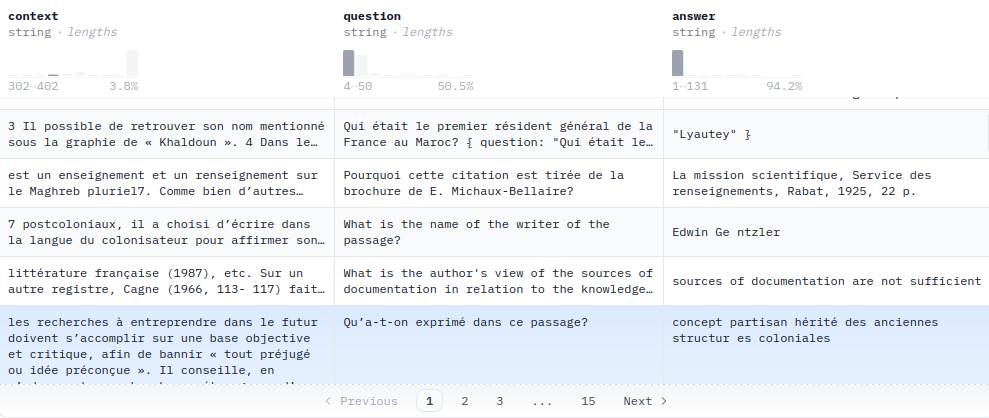

# Outils de traitement de corpus

## Séance 1 :

### Choix de la tâche :

J'ai décidé de m'intéresser à une tâche de Question Answering après une grande hésitation pendant le cours. J'étais en effet intéressée par d'autres tâches comme la Zero-shot CLassification ou encore le Fill-Mask. Cependant, n'ayant jamais eu réellement l'occasion de comprendre comment s'entraîner un modèle visant à répondre à des questions selon un sujet, j'ai préféré m'orienter vers le Question Answering ! Cette tâche donne également une assez grande liberté en termes de choix abordés ! 

### Choix de la dataset : 

J'ai initialement eu quelques difficultés à comprendre quel type de data était attendu pour l'entrainement d'un modèle sur une tâche de Question Answering. J'ai fini par tomber sur une dataset du nom de **qa_morocco_history_v1** qui a pu m'éclaircir en partie.  

Ce corpus est composé de plusieurs textes (en anglais et français, en plus de quelques mots d'origines espagnole et arabe) concernant l'histoire du Maroc et d'autres pays du Moyen-Orient et du Maghreb (même si le Maroc reste au centre des données !). Sur le site de Hugging Face, nous pouvons voir l'input de l'utilisateur : une question sur l'histoire du Maroc, et l'output de l'ordinateur : une réponse adéquate. Chaque question est mise en association à un texte pouvant faire plus d'une quinzaine de lignes concernant la thématique principale abordée par la question. Voici quelques exemples : 

Je n'ai malheureusement trouvé que très peu d'informations concernant les auteurs du corpus ou bien la manière dont il a été constitué. 
L'auteur de la dataset se nomme madmac01 (Mohammed Machrouh de son vrai nom) et semble être à l'origine (ou du moins le posteur) de plusieurs autres corpus sur le même thème. Après un peu d'inversigation (de stalking), j'ai pu voir que Mohammed avait participé à de nombreux projets d'apprentissages automatiques que cela soit sur des tâches de questions/réponses, reconnaissances d'images, ou encore de génération de textes. 

Nous pouvons de plus voir que les data d'entrainements montrées sur le site d'Hugging Face sont au nombre de 3 milles lignes (rows), nous avons ainsi pour cette partie du corpus au moins plus de 10 000 lignes de contextes données au modèle. 

Cette dataset a été utilisée pour l'entrainement d'un modèle (toujours par Mohammed) appelé **morocaan-qa-falcon-7b**. Nous n'avons encore ici que très peu d'informations mais les tags utilisés pour décrire ce modèles sont les suivants : `RefinedWebModel` `history` `custom_mode` `inference Endpoints` `text-generation-inference`. Il semble ici que le modèle soit une structure Transformer. 

### Idée de corpus pour une tâche de questions/réponses : 

En me basant sur le corpus **qa_morocco_history_v1**, j'ai pensé à constituer un corpus au sujet de l'histoire d'un univers fictif et plus précisement celui des bandes dessinées de l'univers DC Comics. 

J'ai trouvé cette idée intéressante car les ressources pouvant permettre d'entrainer un modèle pour répondre à cette tâche sont extrêmement nombreuses. Il y a en effet de nombreux sites dédiés à expliquer et narrer la continuité de l'univers. Certains de ces sites sont officiels ou alimentés par des fans. Beaucoup sont aussi déja structurés en pages correspondant à des évènements ou encore à des eras spécifiques. Ce genre d'univers étant connus pour avoir une multitude de continuités/univers parallèles, la constitution d'un corpus pouvant aider les nouveaux lecteurs à appréhender ce lore m'a semblé assez pertinente et amusante. Le modèle pourrait également répondre à des questions du type "Quel série devrais-je lire avant de lire <autre série> ?" par exemple.

Les sites Web pouvant être utilisés seraient notamment : https://www.dc.com/ et https://dc.fandom.com/wiki/DC_Comics_Database. Ces derniers contiennent les plus grandes bases de données de personnages, évènements et histoires.
