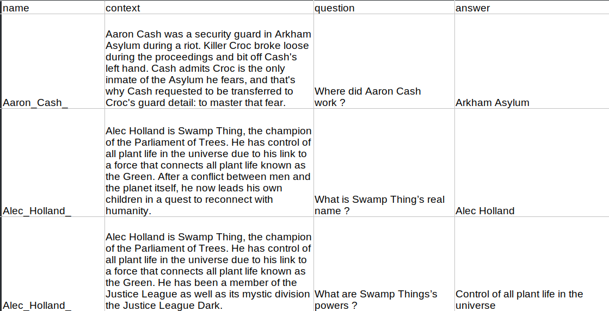
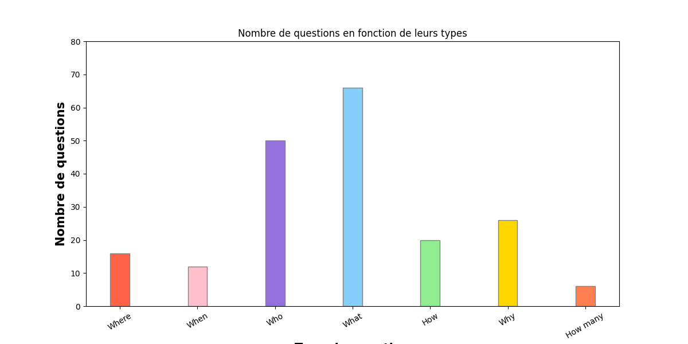

# Outils de traitement de corpus

# Sommaire
1. [Introduction](#introduction)
2. [Données récupérées](#donnees)
3. [Fonctionnement des scripts](#script)
4. [Statistiques](#statistiques)

## 1 - Introduction 

Dans le cadre du cours, j'ai décidé de m'intéresser à une tâche question/réponse ou question answering. Le corpus construit se base sur des courtes descriptions de personnages de l'univers de bandes dessinées américaines DC Comics issues du site communautaire [DC Database](https://dc.fandom.com/wiki/DC_Comics_Database). J'ai décidé de rassembler l'ensemble du travail effectué lors des dernières semaines dans ce document.

Lors de la permière séance, j'ai pu trouver une dataset sur le site d'HuggingFace : [qa_morocco_history_v1](https://huggingface.co/datasets/medmac01/moroccan_history_qa). Ce corpus est composé de plusieurs textes (en anglais et français, en plus de quelques mots d'origines espagnole et arabe) concernant l'histoire du Maroc et d'autres pays du Moyen-Orient et du Maghreb (même si le Maroc reste au centre des données !). Sur le site de Hugging Face, nous pouvons voir l'input de l'utilisateur : une question sur l'histoire du Maroc, et l'output de l'ordinateur : une réponse adéquate. Chaque question est mise en association à un texte pouvant faire plus d'une quinzaine de lignes concernant la thématique principale abordée par la question. Voici quelques exemples :

Je n'ai malheureusement trouvé que très peu d'informations concernant les auteurs du corpus ou bien la manière dont il a été constitué. 
L'auteur de la dataset se nomme madmac01 (Mohammed Machrouh de son vrai nom) et semble être à l'origine (ou du moins le posteur) de plusieurs autres corpus sur le même thème. Après un peu d'inversigation (de stalking), j'ai pu voir que Mohammed avait participé à de nombreux projets d'apprentissage automatique que cela soit sur des tâches de question/réponse, reconnaissance d'images, ou encore de génération de textes. 

Nous pouvons de plus voir que les données d'entrainements montrées sur le site d'Hugging Face sont au nombre de 3 milles lignes (rows), nous savons ainsi pour cette partie du corpus au moins plus de 10 000 lignes de contextes données au modèle. 

Cette dataset a été utilisée pour l'entrainement d'un modèle (toujours par Mohammed) appelé **morocaan-qa-falcon-7b**. Nous n'avons encore ici que très peu d'informations mais les tags utilisés pour décrire ce modèle sont les suivants : `RefinedWebModel` `history` `custom_mode` `inference Endpoints` `text-generation-inference`. Il semble ici que le modèle soit une structure Transformer. 

J'ai donc décidé de suivre une structure de données similaire pour la création de mon corpus. 

## 2 - Présentation des données 

Mon objectif était donc de constituer un corpus de forme similaire à celle du dataset présenté. Pour cela, il fallait commencer par récupérer les courtes descriptions de personnages constituant ici notre colonne "contexte". Pour cela, j'ai utilisé Beautiful Soup afin de récupérer des descriptions d'héros de l'univers DC Comics. La selection de ces descriptions et les procéedés utilisés sont décrits dans la partie 3.
Les questions et réponses ont elles été rédigées manuellement tout au long de ces dernières semaines. Le fichier obtenu est sous format tabulaire (csv) et se présente de la manière suivante : 

Ce tableau est accessible dans le dossier `clean` du dossier `data` et se nomme `donnees.csv`.

J'ai décidé de rédiger des questions et réponses répondant à certaines conditions (en termes de longueur ou de forme) qui seront développées dans la partie statistique de ce document. 

Le corpus obtenu est en anglais et comporte 230 entrées pour lesquelles nous avons un contexte, une question et une réponse. 

## 3 - Fonctionnement des scripts  :

Dans cette partie, je vais présenter le fonctionnement des scripts utilisés pour l'obtention de notre corpus.

### retrieval.py

J'ai décidé d'utiliser la librairie `Beautiful Soup` afin d'extraire le contenu textuel des pages desirées et pour procéder au scrapping. J'avais initialement essayé d'utiliser Selenium mais ai rencontré des problèmes avec l'installation des `web driver`. J'ai désintallé puis ré-installé FireFox (avec des installations différentes) pour contrer d'éventuels problèmes de versions mais je n'ai pas réussi à atteindre des résultats satisfaisants.

Une fois l'outil d'extraction choisi, j'ai pu commencer à écrire des scripts d'essai permettant d'extraire les descriptions désirées. Au vu de la longueur de certaines pages, j'ai pris la décision d'extraire uniquement la courte description présente pour la plupart des personnages entre le sommaire et une citation ou le nom du personnage.

Ces descriptions sont en général composées de quelques phrases courtes et donnant les informations globales d'un personnage : nom, lieu de naissance, pouvoirs, affiliations...

Une fois le contenu textuel souhaité identifié, il fallait pouvoir automatiser cette extraction pour chaque page du site en gérant les éventuelles exceptions. 

Pour cela, il a premièrement fallu faire en sorte d'atteindre la page listant l'ensemble des héros (je n'ai pas pris en compte les villains, lieux ou organisations).

Le lien unique dont lequel nous partons est donc le suivant : https://dc.fandom.com/wiki/DC_Comics_Database

Pour arriver aux listes des personnages, nous devons accéder à la catégorie "heroes" à partir de la page d'accueil.

Une fois arrivé sur la page "heroes", nous pouvons voir que les heroes sont listés par ordre alphabétique en plusieurs pages : 

Au bas de chacune de ces pages se trouve un bouton "next" permettant d'arriver à la page suivante suivante et donc aux autres pages de super-heros : 

Les fonctions permettant d'arriver à la première page de la catégories "heroes" sont les suivantes au sein du script `retrieval.py`. 

**Nous pouvons maintenant chercher à extraire le contenu textuel désiré de chaque page dont le lien est présent sur notre page actuelle.**

Pour cela, nous utilisons deux fonctions permettant d'obtenir le contenu de notre page puis une liste de tous les liens qu'elle contient : 

Les liens de la page ont bien sûre été triés pour ne prendre en compte que ceux menant à des pages individuelles (comme celle de Wonder Woman présentée ci-dessus). Nous parcourons ensuite toutes les pages de notre liste et extrayons le contenu textuel désiré. Ce dernier est stocké dans un fichier `txt` nommé d'après le nom et l'univers du personnage.

Nous commençons par exclure certaines sections de la page qui ne nous intéressent pas comme les citations ou les "nav box" contenant les attributs du personnage (généralement à droite). La description que nous souhaitons obtenir est normalement située au dessus du sommaire. Afin de la retrouver, nous identifions le sommaire (unique) et vérifions si la section située au dessus est un paragraphe. Si c'est le cas, nous obtenons le contenu textuel de cette dernière, sinon nous continuons à remonter dans la structure html jusqu'à trouver un paragraphe. Les personnages moins connus n'ont généralement pas de sommaire et ne sont donc ici pas pris en compte. J'ai également pris le choix de ne prendre que les descriptions faisant plus de 50 caractères (sans limite de caractères, nous obtenons plus de 12 000 descriptions.).

Nous créeons les fichiers correspondants à chaque page au fur et à mesure. 

Nous passons ensuite à la page suivante (listant d'autres personnages) à l'aide de la fonction suivante : 

Nous répétons ensuite les fonctions expliquées précedemment pour extraire de nouveau l'ensemble des descriptions des liens présents sur nos pages. Lorsque la fonction `get_prochaine_page` renvoie `None`, donc quand il n'y plus de page suivante et que nous sommes arrivés à la fin, le programme s'arrête. Cette boucle globale est régie par la fonction `main` :

Ce programme nous a permis d'obtenir l'ensemble des fichiers `txt` stockés dans le dossier `dossier/raw`. Nous avons donc ici notre corpus mais il nous reste à le représenter de manière tabulaire et à l'enrichir avec des questions et des réponses.

### creation_tableau.py

Le programme `creation_tableau.py` permet de créer un tableau contenant l'ensemble des contenus de nos fichiers textes crées à l'aide de `retrieval.py`. Nous créeons deux colonnes : "nom" et "texte" (renommées plus tard manuellement en "name" et "context"). La première contient le nom du personnage concerné par la description (obtenu à l'aide du nom du fichier) et la deuxième contient la description du personnage. Nous avons une description par ligne.

## 4 - Statistiques  :

Pour ce qui est de la rédaction des questions et des réponses, j'ai décidé d'essayer de varier au mieux la forme de ces dernières. J'ai caractérisé ces formes en plusieurs catégories.

### Questions :

Pour les questions, j'ai décidé d'utiliser des questions auxquelles une réponse "oui" ou "non" été attendue. J'ai également décidé d'utiliser des questions dîtes "ouvertes", ces dernières ont été caractérisées en fonction des cas rencontrés, je n'ai par exemple pas considérer les questions attendant un nom, une date, ou une liste comme des questions ouvertes. Généralement, les questions commencant par who, when, where ou how many n'étaient pas considérées comme ouvertes (et pas forcémement comme des questions oui/non). Les questions commençant par what étaient elles considéréeés comme ouvertes ou fermées dépendamment du contexte. Enfin les questions en why ou how étaient généralement caractérisées comme des questions ouvertes. J'ai également catégorisé chaque question en fonction de leurs question words (what, who, where, when, how many...). Voici quelques exemples :

- Questions oui/non : 
    
    - **Are the Batch SW6 Legionnaires time-paradox duplicates ?**
    
        Yes, they are time-paradox duplicates of the Legion engineered by the Time Trapper
    - **At first, were Larry Trainor and Niles Caulder able to communicate ?**

        No
    - **Is Robin an adult ?**

        Dick Grayson was Robin and used the moniker until well into adulthood.

- Questions ouvertes : 

    - **Why did this Superman leave his Earth ?**

        The Superman of the 853rd Century left the Earth when everyone he cared about died.

    - **How did John Diggle’s father die ?**

        His father died during a mission in Vlatava.

Vous pouvez donc voir que des questions peuvent être à la fois oui/non et ouvertes. Les types de réponses utilisées sont elles aussi indépendantes du type de questions posées même si certaines tendances sont observées. Les questions ouvertes ont par exemple plus généralement des réponses longues. 

### Réponses :

Pour ce qui est des réponses, j'ai cherché à varier leurs longueurs et leurs formes du mieux que je pouvais. Certaines ne sont composées qu'un seul mot et d'autres de plusieurs phrases. Certaines reprennent les termes de la question et d'autres moins et utilisent plutôt des synonymes. J'ai décidé de varier ces formes afin d'avoir un corpus pouvant entraîner des modèles visant à extraire une information précise ou à répondre de manière détaillée à un utilisateur.

J'ai donc établi les catégories suivantes :

- Réponses "complete" :

Les réponses appelées "complete" sont des réponses reprenant les termes utilisés dans la question et formant une phrase détaillée. Ces réponses contiennent donc le nom du personnage spécifié dans la question, le terme d'intêret de la question, et reprennent la forme de cette dernière. Voici quelques exemples :

- How did Bart Allen die ?

    **Bart Allen was killed by Calculator while he was fighting a possessed Wally West.**

- How does Zatana cast spells ?

    **Zatanna casts spells by saying what she wants backwards.**

- When did Tim Drake become Red Robin ?

    **Tim Drake had to give up the identity of Robin and begin wearing the costume of Red Robin when he was replaced by Damian Wayne.**

    Ces phrases peuvent également varier en terme de longueur et répondre à des questions de types différents.

- Réponses "partial" :

Les réponses dites "partial" sont des réponses similaires aux complètes mais ne reprenons pas complétement les termes de la questions. Si la question est "Why did Batman eat that burger?", alors une réponse complète serait "Batman ate that burger because..." and une réponse partielle serait "He ate that burger because..." ou "Batman ate it because..." ou "Because he was hangry". Un des termes "importants" de la question est manquant, "hamburger" ou "Batman" (généralement un nom propre ou un nom). Les réponses oui/non ne reprenant pas l'énoncé sont aussi considérées comme partielles. Voici quelques exemples :

- Were Garth, Ayla and Mekt able to use the local lighting beasts to recharge the batteries of their ship ?

    **No, they were attacked by the beasts which caused the siblings to gain electrical powers.**
    
    Les noms ne sont pas repris et la réponse ne répond pas en ré-exprimant l'affirmation, il aurait fallu "No, Garth, Ayla and Mekt were not able to use [...] because they were attacked...".

- Is Superman mean ?

    **No, Superman is noble kind and gentle.** 
    
    La version complète aurait été "No, Superman is not mean. Superman is..."

- What is Bigby Wolf renowned for in the Homelands ?

    **For terrorizing three small pigs and stalking a girl through the woods.**

La distinction entre réponse complète et partielle est parfois assez fine mais la catégorisation plus importante se trouve entre ces deux classes et la suivante.

- Réponses "short" :

Les réponses dites "short" sont des réponses contenant un mot ou uniquement les termes attendus parfois sans aucunes prépositions ou autres unités lexicales :

- Who are Jonathan Samuel Kent’s parents ?

    **Lois Lane and Superman**

- What is the name of Rhea Jones’ new form ?

    **Pupa.**

- Where Constance and Vivian D’Aramis hard to tell apart ?

    **Yes**

J'ai également décidé de rédiger des réponses reprenant mot pour mot (ou quasiment) les termes du contexte. Ces dernières sont dîtes "copy". La plupart des réponses sont "copy" car elles sont courtes et ne comportent qu'un nom ou un lieu cité dans le contexte.  Enfin, d'autres sont dites "complement_info" quand elles apportent des informations supplémentaires à la question (donc des informations non demandées). Par exemple, si la question est "When did Zatanna meet John", une réponse "complete_info" serait une réponse du type "Zatanna met John when she was 16 in an eating competition". Le lieu est donné en plus de la date. Voici quelques exemples :

- Question "copy" :

    - Alec Holland is Swamp Thing, the champion of the Parliament of Trees. He has **control of all plant life in the universe** due to his link to a force that connects all plant life known as the Green. He has been a member of the Justice League as well as its mystic division the Justice League Dark.

        **Control of all plant life in the universe**

    - Diana of Paradise Island is an Amazon princess who has come to be known as the heroine Wonder Woman in the world of men. As Diana Prince, then a yeoman first class in the United States Navy's Women Accepted for Voluntary Emergency Service, or WAVES, Corps, she was originally active in World War II with the Air Corps Intelligence Division. After the war, she returned to Paradise Island. **In the 1970s**, She rejoined the world of men and, as now-Commander Diana Prince, now of the regular United States Navy, joined the Inter-Agency Defense Command.

        **In the 1970s**

- Quesion "complement_info" :

    - Which famous tale is Frau Totenkinder from ?

         Frau Totenkinder **is the Black Forest Witch** from the Hansel and Gretel story

### 4 - Statistiques 

Afin d'obtenir des chiffres permettant de visualiser le nombre de ces catégories différentes dans mon corpus, j'ai premièrement copié le fichier tabulaire crée précédemment et ai attribué des valeurs de 0 (non) et 1 (oui) pour chaque ligne et chaque catégorie de question/réponse. J'ai pensé que ces catégories, ainsi que les longueurs de mes textes et leurs termes les plus fréquents pouvaient être des mesures intéressantes dans le cadre d'un corpus pour des tâches de question/réponse. J'avais initialement surtout pensé aux longueurs (n'ayant jamais travaillé avec ce genre de corpus) mais ai ensuite pensé au "type de question/réponse" comme une métrique intéressante et pouvant témoigner de compétences variées attendues du modèle entrainé sur le corpus.

Ce tableau est accessible dans le dossier **stats** du dossier **data**.

À partir de ce fichier, j'ai pu crée un script python nommé `statistiques.py` et permettant d'obtenir les chiffres souhaités. 

J'ai égalément crée un fichier nommé `datastructures.py` permettant de créer une classe pour chacune de nos lignes et les instances correspondantes à nos catégories : 

Ces deux fichiers sont placés dans le dossier **scripts**.

Dans `statistqiues.py`, nous utilisons `pandas` pour récupérer les données de notre tableau et créer une liste d'objets **Hero**.

Nous obtenons ensuite le nombre de questions et réponses de chaque type à l'aide de fonctions dédiées. Ces comptes sont illustrés grâce à la libraire `Matplotlib` et générés à partir de l'information donnée en argument par l'utilisateur :

- L'argument `question_type` permet d'obtenir le nombre de questions par type (mots interrogatifs) :

La plupart des questions sont des questions commençant par le mot "what".
**where = 16, when = 12, who = 50, what = 66, how = 20, why = 26, how many = 6.**

- L'argument `question_type_yes_no` permet d'obtenir le nombre de questions par type (questions yes/no ou ouvertes) :

Les questions ouvertes sont plus nombreuses que les questions oui/non. Une question n'appartient pas forcément à l'une de ces catégories (exemple: "What is Batman's name ?").

**yes no = 34, open = 62**.

- L'argument `reponse_type` permet d'obtenir le nombre de reponses par type :

La plupart des réponses contiennenst des chaines de mots directement extraites du contexte. Un peu moins de la moitié apportent des informations non demandées explicitement. Les réponses sont majoritairement des reformulations complètes ou partielles de la question.
**complete = 91, partial = 84, short = 56, complement info = 111, copy = 210**

- L'argument `taille` permet d'obtenir le nombre moyen de mots par texte :

Les réponses sont généralement plus longues que les questions ! Une réponse est en moyenne 1.75 plus longue qu'une question. 
**contexte = 65.4695652173913, question = 6.917391304347826, reponse = 12.134782608695652, ratio question réponse = 0.5700465782873523, ratio réponse question = 1.7542426147077308**

- L'argument `fréquence` permet d'obtenir des nuages de mots représentant les mots les plus fréquents de chaque colonne :

Les mots les plus fréquents pour les contextes :

Les mots les plus fréquents pour les questions :

Les mots les plus fréquents pour les réponses :

Les termes les plus fréquents des réponses sont généralement ceux également observables pour les questions. 

- Enfin, l'argument `correlation` permet d'obtenir les correlation et de les p-value des couples de variables longueurs de contextes/questions, contextes/réponses et réponse/questions :

**Coeff context-question = 0.05250069600263348, p-value = 0.42811520932488845**
**Coeff context-reponse = 0.26162921097032826, p-value = 5.910256697148838e-05**
**Coeff question-reponse = 0.14654415098596543, p-value = 0.026259352177883416**

La corrélation la plus elevée concerne les longueurs de contextes et réponses. Ces résultats font sens car les les contextes plus longs amènenent généralement plus d'informations dans les réponses. Nous disposons également d'une p-value très basse indiquant une signicativité de nos résultalts pour cette catégorie.

Enfin, j'ai également rédigé un programme nommé `analyse.py` contenant une analyse morphosyntaxique de chaque contexte (attribuant une forme, un lemme et une POS à chaque token). Le fichier résultant se nomme `donnees_analysees.csv` et se trouve dans le dossier **stats** du dossier **data**. Il se présente de la manière suivante : 

Cette analyse pourrait permettre d'améliorer la performance d'un modèle en fournissant de nouveaux features ou bien d'établir d'autres bilans statistiques (quels verbes sont les plus courants dans la réponse d'une question contenant "what" par exemple...).

